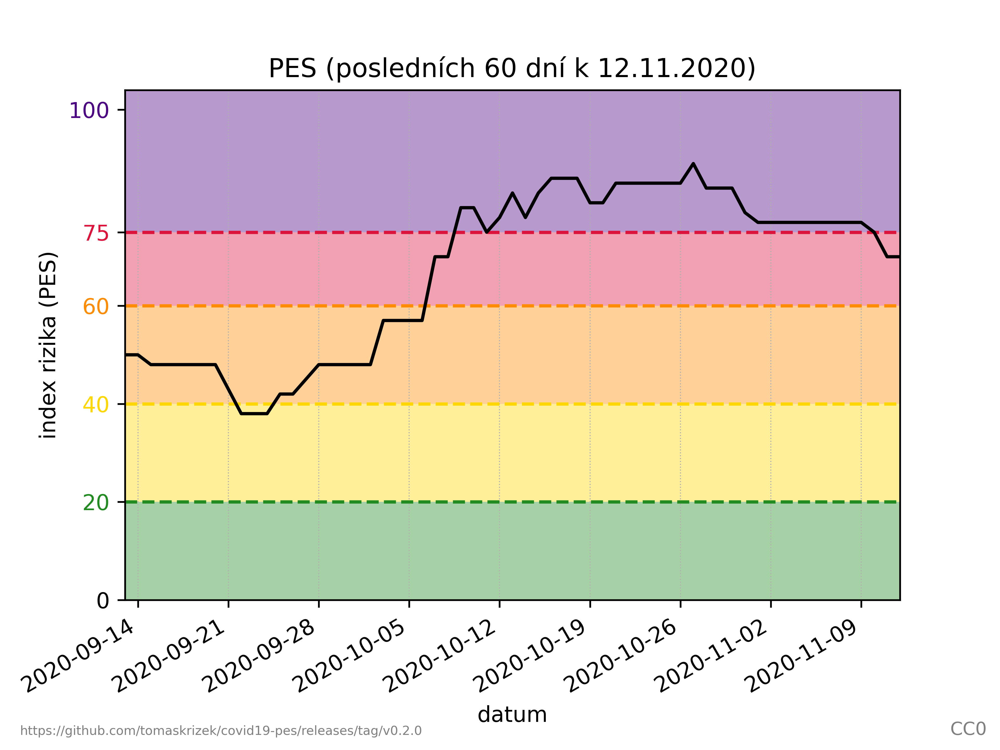
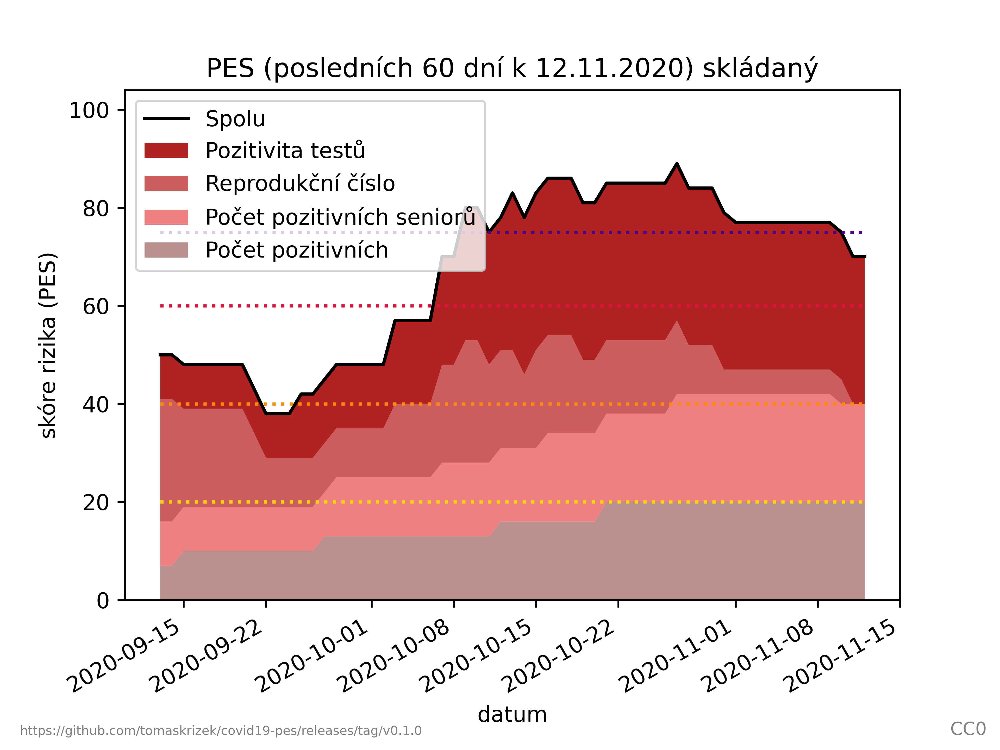
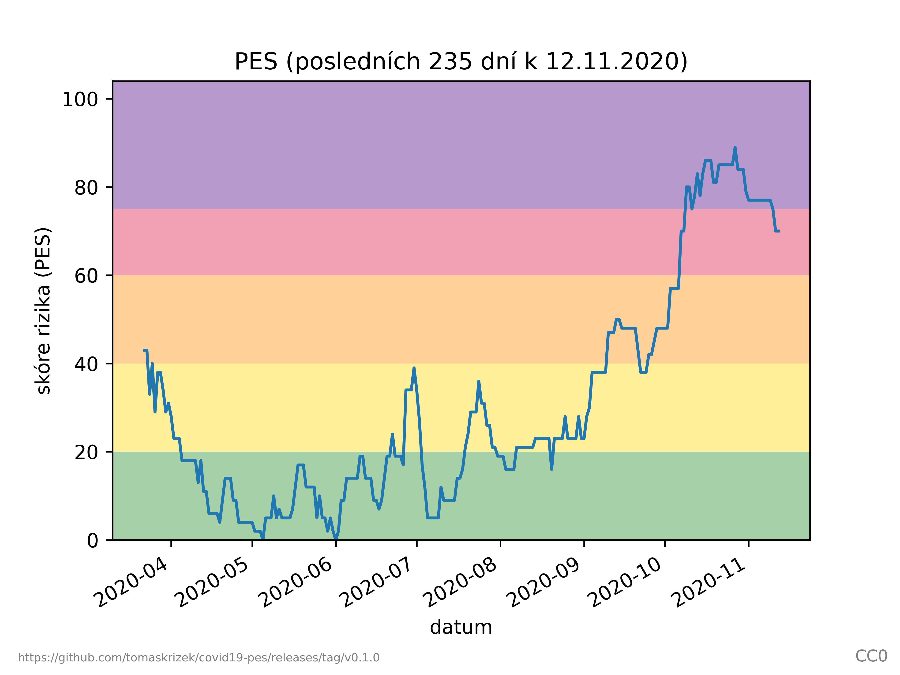

# PES: Proti epidemický systém - COVID-19 ČR

## Upozornění

- **Ve výpočtu mohou být chyby, za výsledky neručím**
- **Otevřená data nejsou tak přesná, takže ani výsledné skóre nemůže být tak přesné jako od MZČR/ÚZIS**

## Situace k 12.11.2020

### Posledních 60 dní



### Posledních 60 dní - skládaný



### Posledních 235 dní



## Použití

Projekt vyžaduje Python 3 a matplotlib.

```
./pes.py 60
```

## Metodika

- [Návod pro výpočet indexu rizika](https://koronavirus.mzcr.cz/wp-content/uploads/2020/11/Stru%C4%8Dn%C3%BD-n%C3%A1vod-pro-v%C3%BDpo%C4%8Det-indexu-rizika.pdf)
- [Tisková zpráva PES](https://koronavirus.mzcr.cz/epidemiologickou-situaci-bude-nove-znazornovat-system-hodnoceni-pes/)

## Licence

- Kód: [GPLv3+](LICENSE.txt)
- Obrázky: CC0 (public domain)
