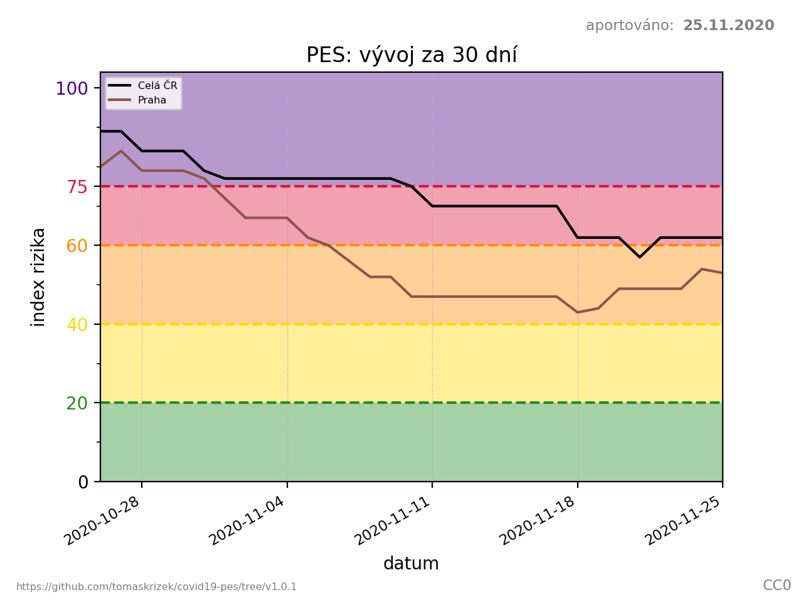
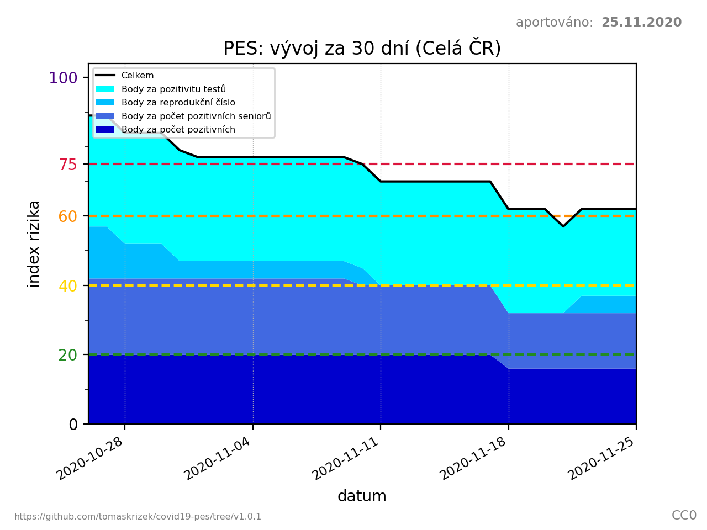
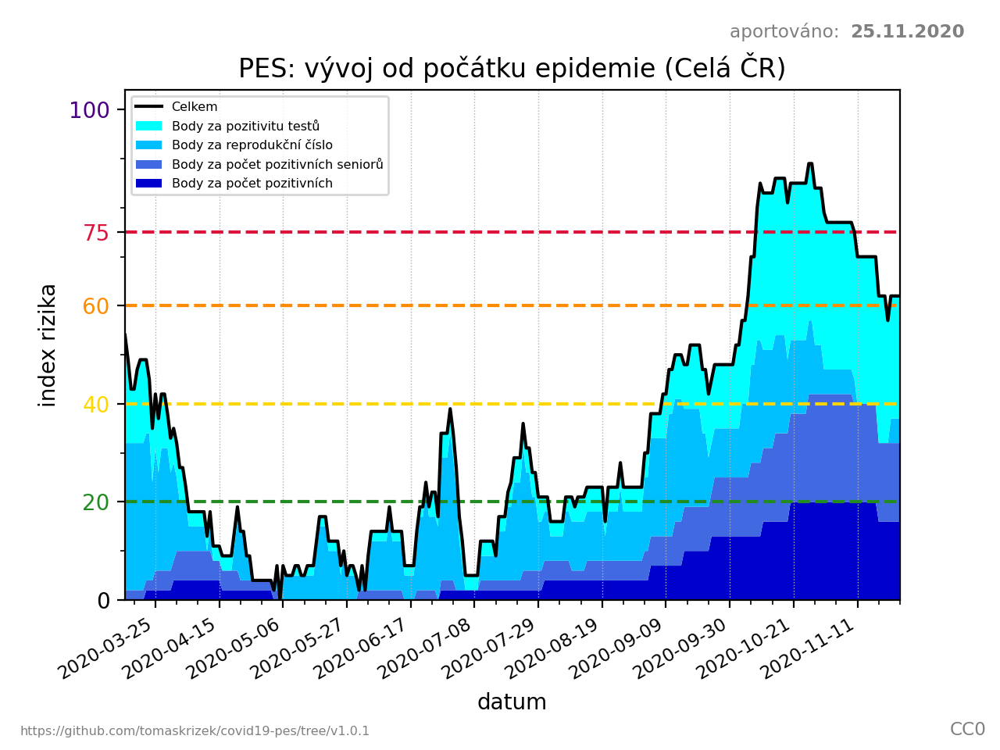
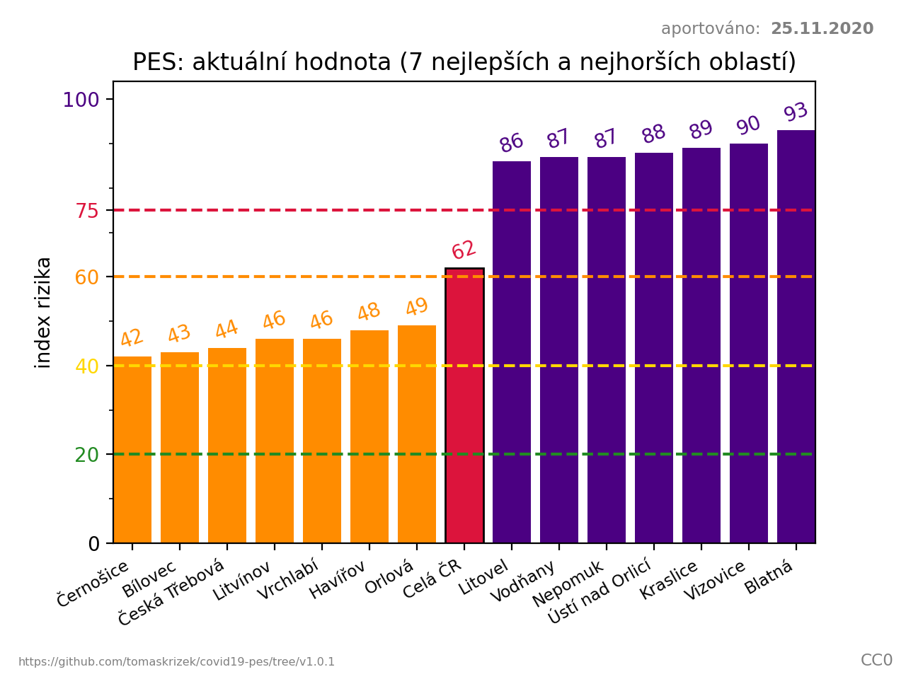

# PES: Protiepidemický systém - COVID-19 ČR

Projekt pro výpočet a vykreslování indexu rizika Protiepidemického systému ČR
(PES) z otevřených dat.

## Zdroje dat

Vzhledem k použitým zdrojům dat se může výsledný index rizika mírně odlišovat
od [oficiálního indexu rizika](https://onemocneni-aktualne.mzcr.cz/pes).

- [COVID-19: Přehled epidemiologické situace dle hlášení krajských hygienických
  stanic podle
  ORP](https://onemocneni-aktualne.mzcr.cz/api/v2/covid-19/orp.csv)
  z [COVID-19 API v2](https://onemocneni-aktualne.mzcr.cz/api/v2/covid-19)
- Věkové složení obyvatelstva dle ORP z [Veřejné databáze
  ČSÚ](https://vdb.czso.cz/vdbvo2/faces/cs/index.jsf?page=home) (k 31.12.2018,
  resp 31.12.2019)

## Ukázky diagramů

### Vývoj indexu rizika za 30 dní (srovnání celé ČR a Prahy)



### Podrobný vývoj indexu rizika za 30 dní



### Podrobný vývoj indexu rizika od počátku epidemie



### Srovnání indexů rizika dle oblastí (nejhorší a nejlepší)



## Použití

Projekt vyžaduje Python 3.6 a matplotlib.

### Příklady

```
./pes.py                              # vykreslí diagramy od počátku epidemie pro celou ČR
./pes.py 30 --fetch                   # aktualizuje dostupná data a vykreslí vývoj za 30 dní
./pes.py 30 --region Praha            # vykreslí vývoj za 30 dní pro Prahu
./pes.py 30 --region 'Celá ČR' Praha  # vykreslí srovnání celé ČR a Prahy za 30 dní
./pes.py --help                       # zobrazí kompletní možnosti a dokumentaci
```

## Odkazy

- [Protiepidemický systém ČR](https://onemocneni-aktualne.mzcr.cz/pes)
- [Návod pro výpočet indexu rizika](https://koronavirus.mzcr.cz/wp-content/uploads/2020/11/Stru%C4%8Dn%C3%BD-n%C3%A1vod-pro-v%C3%BDpo%C4%8Det-indexu-rizika.pdf)
- [Tisková zpráva PES](https://koronavirus.mzcr.cz/epidemiologickou-situaci-bude-nove-znazornovat-system-hodnoceni-pes/)
- [COVID-19 v ČR: Otevřené datové sady a sady ke stažení](https://onemocneni-aktualne.mzcr.cz/api/v2/covid-19)

## Licence

- Kód: [GPLv3+](LICENSE.txt)
- Obrázky: [CC0](https://creativecommons.org/publicdomain/zero/1.0/legalcode)
- Počty obyvatel: [Podmínky užívání dat ČSÚ](https://www.czso.cz/csu/czso/podminky_pro_vyuzivani_a_dalsi_zverejnovani_statistickych_udaju_csu)
