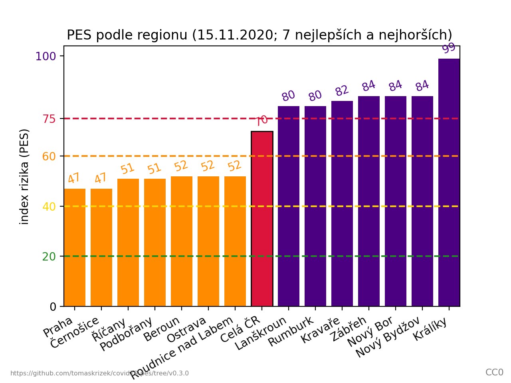

# PES: Proti epidemický systém - COVID-19 ČR

Projekt pro výpočet a vykreslovování indexu rizika Protiepidemického systému ČR
(PES) z otevřených dat.

## Zdroje dat

Vzhledem k použitým zdrojům dat se může výsledný index rizika mírně odlišovat
od [oficiálního indexu rizika](https://onemocneni-aktualne.mzcr.cz/pes).

- [COVID-19: Přehled epidemiologické situace dle hlášení krajských hygienických
  stanic podle
  ORP](https://onemocneni-aktualne.mzcr.cz/api/account/verejne-distribuovana-data/file/dip%252Fweb_orp.csv)
  z [COVID-19 API v2](https://onemocneni-aktualne.mzcr.cz/api/v2/covid-19)
- Věkové složení obyvatelstva dle ORP z [Veřejné databáze
  ČSÚ](https://vdb.czso.cz/vdbvo2/faces/cs/index.jsf?page=home) (k 31.12.2018,
  resp 31.12.2019)

## Ukázky grafů

### Posledních 60 dní - skládaný


### Posledních 235 dní


### Index rizika dle regionu (nejhorší a nejlepší)



## Použití

Projekt vyžaduje Python 3.6 a matplotlib.

### Příklady

```
./pes.py                    # vykresli grafy od zacatku epidemie pro celou CR
./pes.py 30 --fetch         # aktualizuje dostupna data a vykresli poslednich 30 dni
./pes.py 30 --region Praha  # vykresli grafy za poslednich 30 dni pro Prahu
./pes.py --help             # zobrazi kompletni moznosti a dokumentaci
```

## Odkazy

- [Protiepidemický systém ČR](https://onemocneni-aktualne.mzcr.cz/pes)
- [Návod pro výpočet indexu rizika](https://koronavirus.mzcr.cz/wp-content/uploads/2020/11/Stru%C4%8Dn%C3%BD-n%C3%A1vod-pro-v%C3%BDpo%C4%8Det-indexu-rizika.pdf)
- [Tisková zpráva PES](https://koronavirus.mzcr.cz/epidemiologickou-situaci-bude-nove-znazornovat-system-hodnoceni-pes/)

## Licence

- Kód: [GPLv3+](LICENSE.txt)
- Obrázky: CC0 (public domain)
